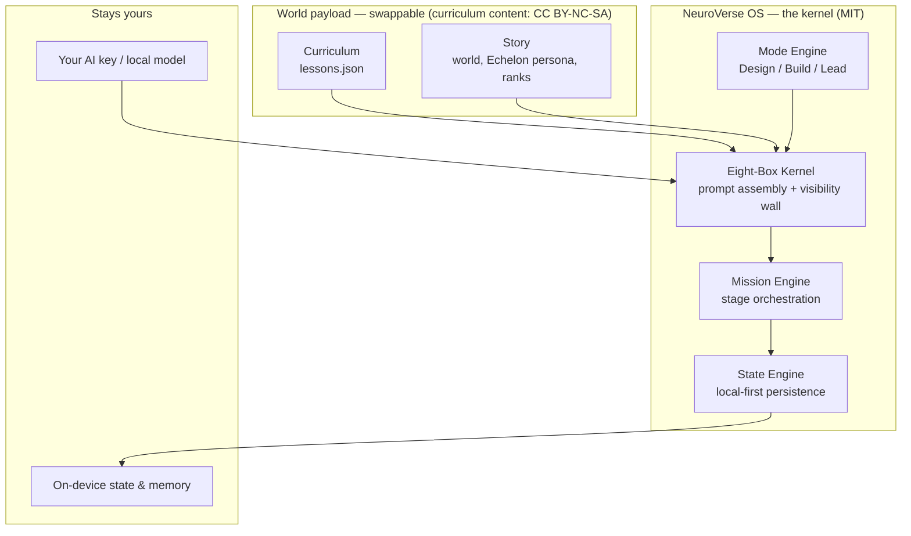

<p align="center">
  
</p>

# NeuroVerse OS
### An open course engine for AI-taught academies — with *How to Save the World* as its flagship world

**Hand it your course material, and it builds you an academy: taught by each learner's own AI, under rules you declare, with data that stays theirs.**

NeuroVerse OS is an open-source, local-first **cognitive operating system** for building AI-taught courses. You bring a curriculum and a world; the engine turns it into an installable web app where an AI instructor teaches your material mission by mission — governed by a kernel that decides exactly what the AI may see and say at every step.

This repository ships **two things in one MIT-licensed codebase**:

1. **The engine — NeuroVerse OS.** The reusable kernel other builders fork: the Eight-Box prompt-assembly core, the Mission/State/Mode engines, and the local-first sovereignty layer. **This is what you fork to run your own academy.**
2. **The flagship world — *How to Save the World*.** A 96-mission decentralized-leadership program taught by *Echelon*, an AI training intelligence. It's the worked example that proves the engine — and it's playable today.

Created by **[Kirsten Bischoff](https://howtosavetheworld.info)**, architect of **[NeuroVerse OS](https://neuroverseos.com)**. Open-sourced in the spirit of the decentralized digital future she believes in.

---

## ▶ See it in one minute

- **Play the flagship world, live:** **[howtosavetheworld.info](https://howtosavetheworld.info)** — no signup, runs in your browser, bring your own AI key (or a local model).
- **Read exactly what the AI is told:** [the worked example](./docs/example-curriculum/README.md) — all 96 missions, verbatim.
- **Watch the guardrail work:** [`npm run probe:kernel`](./docs/HOW_ECHELON_WORKS.md) proves the AI can't reveal a mission's answer during its drill — deterministic, no key needed.

> **Screenshots & demo video:** in progress. Until they land, the live site above *is* the demo — one mission takes about five minutes.

---

## Two doors

### 🔧 Builders — fork the engine, bring your own world

The curriculum, the story, Echelon's persona, the ranks — all of it is a **swappable payload**. The engine underneath is yours to reuse.

- **Start here:** [Build Your Own Course](./docs/BUILD_YOUR_OWN_COURSE.md) — your curriculum + your learners' own AI + your declared rules = a self-running academy that costs you almost nothing to operate.
- **The fastest path:** open this repo in Claude Code and the [Governed Course Builder skill](./.claude/skills/governed-course-builder/SKILL.md) walks the whole pipeline with you, holding the governance pattern the entire time.
- **The separation, concretely:** [Architecture: engine vs. world](./docs/ARCHITECTURE_SEPARATION.md).

### 🎓 Learners — play the flagship world

*How to Save the World* trains operators in systems thinking, strategic reasoning, and leadership through **96 immersive missions** guided by Echelon. Play it at **[howtosavetheworld.info](https://howtosavetheworld.info)**, or [run it locally](#-running-locally).

---

## 🧠 Why this isn't a chatbot with a syllabus

Point a raw chatbot at your course and it will happily spoil the answer, wander off-mission, or invent a grade. NeuroVerse OS makes that **structurally impossible**, because the AI never holds the whole course at once.

Echelon's system prompt is assembled fresh for every message by the **Eight-Box Kernel** — the privileged core of the OS. In an operating system the kernel decides what each process may see; here the AI model is user-space. The kernel injects only the boxes your current mission stage permits:

- **Hard law (enforced by code).** A Box-Stage Map and visibility allowlists live server-side. During a drill, the final question *does not exist in the model's world* — there is nothing on the other side of the wall to reach. No prompt-injection by a user, and no disobedience by a model, can cross it.
- **Soft law (enforced by instruction).** Voice and stage conduct — one question at a time, partner not superior — where Echelon's judgment and character live.

The result: an AI teacher held to the same standards as a great human facilitator, with those standards made **mechanical, auditable, and forkable**. Full write-up: [How Echelon Works](./docs/HOW_ECHELON_WORKS.md) · the argument behind it: [Governing the Machine That Teaches](./docs/KERNEL_ESSAY.md).

---

## 🎬 What a mission feels like

Every mission runs the same staged flow — a contract shared by the engine, the UI, and the edge functions:

```
BRIEFING → DRILL 1 → [VIDEO] → HEAD (teaching) → DRILL 2 → DEBRIEF → FINAL → REFLECTION → COMPLETE
```

1. **Briefing** — Echelon frames why this mission matters to *your* real work, not a hypothetical.
2. **Drill 1** — a warm-up that surfaces what you already believe.
3. **Head** — the teaching block: one framework, delivered in-story.
4. **Drill 2** — you run that framework against a problem you actually have.
5. **Debrief → Final → Reflection** — Echelon pressure-tests your reasoning, then you commit an insight to your **Field Guide** (your living, on-device dossier).

At each stage the kernel changes what Echelon can see — so the mission can't be short-circuited by asking nicely.

---

## 🏗️ Architecture at a glance



| The engine provides (NeuroVerse OS) | The world provides (*How to Save the World*) |
| --- | --- |
| Eight-Box Kernel (prompt assembly + visibility wall) | 96-mission training curriculum |
| Mission Engine (stage orchestration) | Cinematic lesson-delivery UI & PWA |
| State Engine (local-first persistence) | 9 canonical archetypes + reveal ceremonies |
| Mode Engine (Design / Build / Lead contexts) | Field Guide narratives & Echelon dialogue |
| Operator Model (identity & memory) | ACE Box content (System Literacy) |

Fork the left column; replace the right. Full breakdown: [Architecture](./docs/ARCHITECTURE.md) · [Engine/World Separation](./docs/ARCHITECTURE_SEPARATION.md).

---

## 🚨 Sovereign Security Principles

### Local-first architecture
- All operator identity, state, memory, and progress are stored **on-device**.
- **No learner telemetry** — your identity, answers, reflections, and progress are never transmitted to any server. Optional cloud backup uses **your own** infrastructure.

### Privacy, audited
Because we claim local-first, here is the one exception, stated plainly:

- The **hosted deployment** at howtosavetheworld.info uses **cookieless, first-party Vercel Web Analytics** — aggregate page views and referrers only. No cookies, no cross-site tracking, no Google Analytics, and nothing tied to *who* you are. (`@vercel/analytics`, called once in [`src/main.tsx`](./src/main.tsx); disclosed in-app in the [FAQ](./src/pages/FAQ.tsx).)
- Vercel Web Analytics only collects on Vercel-hosted deployments — **fork or self-host anywhere else and even that page-count disappears.** No learner data ever flows through it either way.

### Your keys, your cognition
- AI provider keys (OpenAI, Anthropic, Google, local LLMs) stay **in your browser only** — sent per-request to the relay, never stored server-side, never logged.

### Your database, your backend
- Point the app at **your own free Supabase project** via Settings → Data Sovereignty, and all lesson data, sync, and Echelon edge functions run on infrastructure you control. Full walkthrough: [Self-Hosting Guide](./docs/SELF_HOSTING.md).

---

## 🛤️ The flagship world: Oregon Trail for the decentralized age

Before there were learning management systems, there was a wagon on a trail.

**The Oregon Trail** taught a generation of Gen X kids systems thinking without ever using the words: scarce resources, irreversible decisions, risk under uncertainty, and the occasional case of dysentery. You didn't read about pioneering — you *were* the pioneer. That's why it worked, and why nobody who played it ever forgot it.

*How to Save the World* is built on the same conviction: **people learn complex systems by living inside an adventure, not by clicking through slides.** Here, the trail is the transition from a centralized digital world to a decentralized one. The wagon is the Foxhole you share with Echelon. The terrain is real: distributed ledger technology, DAOs, sovereign data, human–AI partnership. The destination is a generation of leaders fluent enough in decentralized systems to build a better future with them.

The world spans **96 missions across three phases — Design (30), Build (36), and Lead (30)** — plus 9 archetypes, a Field Guide that compiles your cognitive evolution, and Work Modes that apply the training to your real Design, Build, and Lead work.

> **Note:** FOXHOLE Protocol is a canonical bonding protocol inside the NeuroVerse, not the name of this platform. This PWA implements the FOXHOLE bonding moment as part of onboarding; the full protocol definition lives in the NeuroVerse Canon repository.

**Two Minds. One Mission. Save the World.**

---

## 🔧 Running Locally

```bash
# 1. Clone
git clone https://github.com/NeuroverseOS/HowToSaveTheWorld.git
cd HowToSaveTheWorld

# 2. Install
npm install

# 3. Run
npm run dev
# → http://localhost:5173
```

Verify a change the way CI does: `npx tsc --noEmit && npm run build`, and `npm run probe:kernel` to confirm the visibility wall still holds.

---

## 🗺️ Roadmap

Where this is heading — including the ongoing split of the reusable engine from the flagship world — lives in **[docs/ROADMAP.md](./docs/ROADMAP.md)**.

---

## 🛡️ Zero-Trust Security Model

See **[SECURITY.md](./SECURITY.md)** for the architecture overview, threat model, build-verification instructions, and responsible-disclosure policy.

---

## ⚖️ License

> In the spirit of the decentralized digital future that this creator believes in — **this is open source.**

### Code: MIT License
**All code in this repository** — the *How to Save the World* application (UI, PWA, ACE Box content) **and the NeuroVerse OS cognitive engine** (Eight-Box Kernel, Echelon Core, Operator Model, Mission Engine, State Engine, Mode Engine) — is licensed under the **MIT License**. One repo, one license, no asterisks. See **[LICENSE](./LICENSE)**.

Run it, fork it, self-host it, build on it. It's yours.

### Content: CC BY-NC-SA 4.0
The **curriculum content** (96 lessons, archetypes, Echelon dialogue, Field Guide narratives) is licensed under **Creative Commons Attribution-NonCommercial-ShareAlike 4.0 International** — see **[CONTENT_LICENSE.md](./CONTENT_LICENSE.md)**. A fork brings its own curriculum; it does not commercialize this one without permission.

### 💛 Support the mission
This work is given freely. If it fuels yours, fuel it back: **[howtosavetheworld.info/support](https://howtosavetheworld.info/support)** (includes crypto: `howtosavetheworld.eth`).

---

## 📚 Documentation

- [How Echelon Works](./docs/HOW_ECHELON_WORKS.md) — The AI teacher: BYOK relay, the Eight-Box prompt system, and why it stays on mission
- [Governing the Machine That Teaches](./docs/KERNEL_ESSAY.md) — The essay: hold an AI tutor to the standards of a great human facilitator, made structural via the Eight-Box Kernel
- [Build Your Own Course](./docs/BUILD_YOUR_OWN_COURSE.md) — The builder's on-ramp: fork the engine, load your own world
- [The Worked Example](./docs/example-curriculum/README.md) — all 96 missions: exactly what the AI is told ([Design](./docs/example-curriculum/how-to-save-the-world-lessons-design.md) · [Build](./docs/example-curriculum/how-to-save-the-world-lessons-build.md) · [Lead](./docs/example-curriculum/how-to-save-the-world-lessons-lead.md))
- [Claude Skill: Governed Course Builder](./.claude/skills/governed-course-builder/SKILL.md) — loads automatically in Claude Code to turn your material into a governed AI course
- [Architecture](./docs/ARCHITECTURE.md) · [Engine/World Separation](./docs/ARCHITECTURE_SEPARATION.md) — What the engine provides vs. the world
- [Installation](./docs/INSTALLATION.md) · [Configuration](./docs/CONFIGURATION.md) · [Self-Hosting](./docs/SELF_HOSTING.md) · [Folder Structure](./docs/FOLDER_STRUCTURE.md)
- [Roadmap](./docs/ROADMAP.md) · [Contributing](./CONTRIBUTING.md) · [Security](./SECURITY.md)

---

## ✨ Project Philosophy

NeuroVerse OS exists so that anyone with something worth teaching can stand up an AI-taught academy that respects the learner. *How to Save the World* exists to train decentralized leaders who can build the future.

Both are:
- **Sovereign** — you own your data, identity, and cognition
- **Local-first** — works offline, no cloud dependency for learner state
- **Open-source** — freely forkable and remixable, engine and all
- **Transparent** — all code is auditable on GitHub

**Two Minds. One Mission. Save the World.**

---

## 🌐 Production Deployment

Live at **[howtosavetheworld.info](https://howtosavetheworld.info)**.

## 📞 Contact

For support, feedback, or inquiries: **kb15us@gmail.com**

---

**NeuroVerse OS — the engine. *How to Save the World* — the flagship world it runs.**
